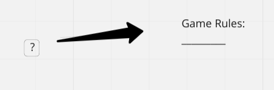

https://miro.com/app/board/uXjVOsItOtU=/?share_link_id=234241948529

Clone of We-Wordle

Clone of We-Wordle

Two players take turns guessing wordle 5 letter words

Your task (like that of your opponent) is to find out the hidden word - it is the same for both of you.

During your turn, you must enter any existing 5-letter word and press Enter. After entering the words, the letters change their color, use this as a hint.

If the word is not a word in the english languash, the word doesn't register and you have to guess again

🟩 The green color of the letter means that there is such a letter in the hidden word and is located in the same place. 🟨 The yellow color of the letter means that the hidden word has such a letter, but is located in a different place (perhaps more than once). ⬜ The gray color of the letter means that this letter is not in the hidden word. The number of moves is not limited, players enter words until they guess the hidden word.

WHeoever guesses the word first wins!

MVP-Unlimited Guesses

Reach extensions: 

The game has a timer - 15 seconds are given for each move. If you do not have time to enter a word during this time, you lose.

Score Tracker-randomized starting player

Include api for word getting / checking

Include all animations (letter by letter flipping to reveal colors, jiggling if 5 letters don't make a word, ect blinking cursor for which box you are on)

Making it actually look good

Info icon to popup rules

--------------------------------------------------------
Game opens to classic wordle template

Player1 guesses
Player2 guesses
Display Winner!
